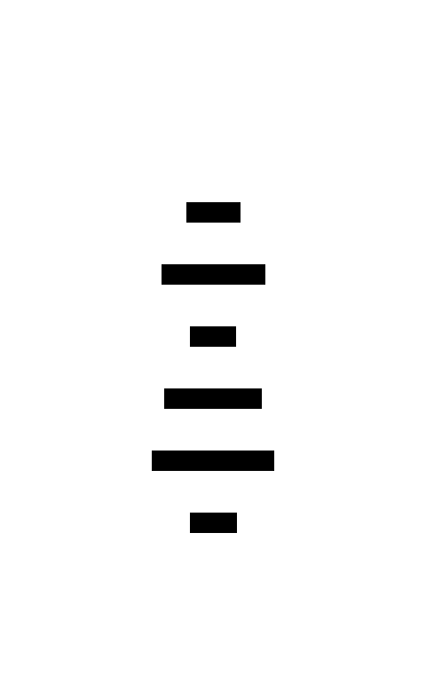

# How to play

You are going to write a "Painter". You connect a websocket to "Jeeves" and send RGBA encoded pixel data to Jeeves everytime it asks you for pixels.

Here are examples of painters in various languages:

* [Javascript](https://github.com/MaybeJustJames/Jeeves/blob/main/examples/javascript/painter.js)
* [Python](https://github.com/MaybeJustJames/Jeeves/blob/main/examples/python/painter.py)

## Communicating with Jeeves

1. Connect a websocket to: `wss://rse.pagekite.me`

2. `WHO_ARE_YOU`. You will receive: `{"msg": "?"}`
   You should respond with a JSON object that looks like this:
   `{"msg": "?", "?": "painter", "name": ${YOUR NAME}, "url": ${A URL OF YOUR CHOOSING}}`
   
3. `BUFFER_SIZE`. You will receive: `{"msg": "size", "w": integer, "h": integer}`
   Where `w` is the width of the image data you should send Jeeves in pixels, and
   `h` is the height of the image data you should send Jeeves.
   
4. `SEND_ME_PIXELS`. You will receive: `{"msg": "p"}`
   You should respond with binary data containing `w` × `h` pixels in row major order. Each pixel
   should be 4 bytes of RGBA (1 byte for red; 1 byte for green; 1 byte for blue; and
   1 byte for _alpha_ a.k.a. transparency).
   

## Advanced

You can request the pixel data of all painters (as the canvas does) by sending a `SEND_ME_PIXELS`
message (shaped like, `{"msg": "p"}`) to Jeeves. The response is a binary structure in 2 parts:

1. bytes 0, 1 are an unsigned big-endian integer (buffer DIMENSION; that is,
   the buffer is DIMENSION × DIMENSION pixels in size).
2. bytes 2... are the pixel data interpreted the same way as `SEND_ME_PIXELS` above.
